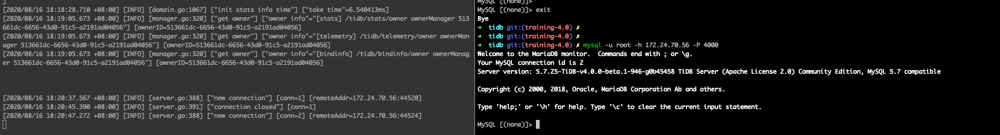
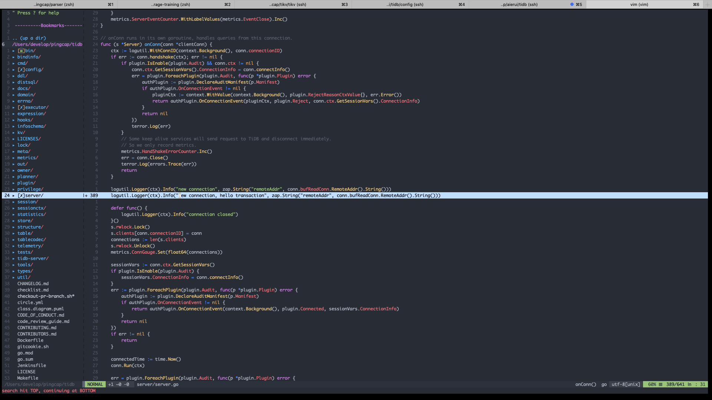
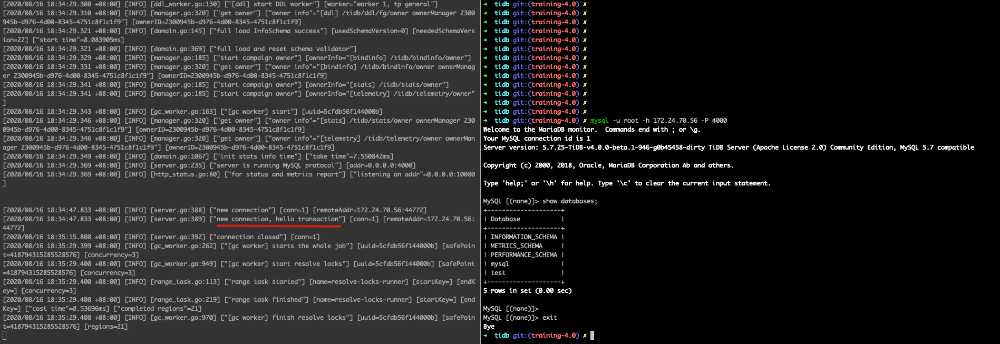

# 安装部署

> 尝鲜推荐 [TiUP](https://tiup.io/)

本文将介绍 tidb 家族通过源代码编译安装流程，安装包含：
- 1 TiDB
- 1 PD
- 3 TiKV

## 机器配置

- 通用型 g6（ecs.g6.large）2 vCPU 8 GiB
- CentOS 7.5 64位

## 环境

- go
  ```
  mkdir -p /home/go-core-lib && cd /home/go-core-lib && wget https://dl.google.com/go/go1.4.3.linux-amd64.tar.gz && tar -zxvf go1.4.3* && mv go 1.4.3
  ```
- rust
  ```
  curl https://sh.rustup.rs -sSf | sh
  ```

## 安装 TiDB

1. 克隆代码
   ```
    git clone git@github.com:aierui/tidb.git /path/to
   ``` 
2. 编译
   ```
   cd /path/to
   make
   // Build TiDB Server successfully!
   ```

## 安装 PD

1. 克隆代码
   ```
    git clone git@github.com:pingcap/pd.git /path/to
   ``` 
2. 编译
   ```
   cd /path/to
   make
   ```

## 安装 TiKV

1. 克隆代码
   ```
    git clone git@github.com:tikv/tikv.git /path/to
   ``` 
2. 编译
   ```
   cd /path/to
   make
   // Finished release [optimized] target(s) in 33m 23s
   ```

## 配置一个集群

1. 启动 PD

  ```
  // 在 pd 项目根目录
  export HostIP="172.24.70.56"

  ./bin/pd-server --name="pd" \
            --data-dir="pd" \
            --client-urls="http://${HostIP}:2379" \
            --peer-urls="http://${HostIP}:2380" \
            --log-file=pd.log &
  ```

2. 启动 TiKV
   ```
   // 在 TiKV 目录
   cd target/release/bin
   ./tikv-server --pd-endpoints="${HostIP}:2379" \
                --addr="127.0.0.1:20160" \
                --data-dir=tikv1 \
                --log-file=tikv1.log &

    ./tikv-server --pd-endpoints="${HostIP}:2379" \
                    --addr="127.0.0.1:20161" \
                    --data-dir=tikv2 \
                    --log-file=tikv2.log &

    ./tikv-server --pd-endpoints="${HostIP}:2379" \
                    --addr="127.0.0.1:20162" \
                    --data-dir=tikv3 \
                    --log-file=tikv3.log &
   ```

3. 验证 PD、TiKV 是否部署成功
   ```
   // use the pd-ctl tool 
   ./bin/pd-ctl store -u http://172.24.70.56:2379
   ```

    <details>

    ```json
    {
      "count": 3,
      "stores": [
        {
          "store": {
            "id": 1,
            "address": "127.0.0.1:20160",
            "version": "4.1.0-alpha",
            "status_address": "127.0.0.1:20180",
            "git_hash": "ae7a6ecee6e3367da016df0293a9ffe9cc2b5705",
            "start_timestamp": 1597570904,
            "deploy_path": "/data1/develop/pingcap/tikv/tikv/target/release",
            "last_heartbeat": 1597571004991536254,
            "state_name": "Up"
          },
          "status": {
            "capacity": "39.25GiB",
            "available": "19.98GiB",
            "used_size": "31.51MiB",
            "leader_count": 1,
            "leader_weight": 1,
            "leader_score": 1,
            "leader_size": 1,
            "region_count": 1,
            "region_weight": 1,
            "region_score": 1,
            "region_size": 1,
            "start_ts": "2020-08-16T17:41:44+08:00",
            "last_heartbeat_ts": "2020-08-16T17:43:24.991536254+08:00",
            "uptime": "1m40.991536254s"
          }
        },
        {
          "store": {
            "id": 4,
            "address": "127.0.0.1:20161",
            "version": "4.1.0-alpha",
            "status_address": "127.0.0.1:20180",
            "git_hash": "ae7a6ecee6e3367da016df0293a9ffe9cc2b5705",
            "start_timestamp": 1597570918,
            "deploy_path": "/data1/develop/pingcap/tikv/tikv/target/release",
            "last_heartbeat": 1597570998472699813,
            "state_name": "Up"
          },
          "status": {
            "capacity": "39.25GiB",
            "available": "22.12GiB",
            "used_size": "31.5MiB",
            "leader_count": 0,
            "leader_weight": 1,
            "leader_score": 0,
            "leader_size": 0,
            "region_count": 1,
            "region_weight": 1,
            "region_score": 1,
            "region_size": 1,
            "start_ts": "2020-08-16T17:41:58+08:00",
            "last_heartbeat_ts": "2020-08-16T17:43:18.472699813+08:00",
            "uptime": "1m20.472699813s"
          }
        },
        {
          "store": {
            "id": 6,
            "address": "127.0.0.1:20162",
            "version": "4.1.0-alpha",
            "status_address": "127.0.0.1:20180",
            "git_hash": "ae7a6ecee6e3367da016df0293a9ffe9cc2b5705",
            "start_timestamp": 1597570999,
            "deploy_path": "/data1/develop/pingcap/tikv/tikv/target/release",
            "state_name": "Down"
          },
          "status": {
            "capacity": "0B",
            "available": "0B",
            "used_size": "0B",
            "leader_count": 0,
            "leader_weight": 1,
            "leader_score": 0,
            "leader_size": 0,
            "region_count": 0,
            "region_weight": 1,
            "region_score": 0,
            "region_size": 0,
            "start_ts": "2020-08-16T17:43:19+08:00",
            "last_heartbeat_ts": "1970-01-01T08:00:00+08:00"
          }
        }
      ]
    }
    ```
    </details>

4. 启动 TiDB
   ```
    1) 在 TiDB 项目根目录执行
    cp config/config.toml.example config/config.toml
    2) 修改配置文件中 store、path
    # Registered store name, [tikv, mocktikv]
    store = "tikv"

    # TiDB storage path.
    path = "172.24.70.56:2379"
    
    3) 启动
    ./bin/tidb-server -config config/config.toml

    4) 执行
    mysql -u root -h 172.24.70.56 -P 4000
   ```
5. 结果
   


## Hello Transaction

问题：使得 TiDB 启动事务时，会打一个 “hello trasaction” 的日志。

思路：通过上面截图可看出，客户端在连接 TiDB 时会打印一条日志(如下)，全局搜索关键词 `new connection`，同理增加一行日志，改动见下面截图。

```
[2020/08/16 18:20:37.567 +08:00] [INFO] [server.go:388] ["new connection"] [conn=1] [remoteAddr=172.24.70.56:44520]
```




修改后重新打包编译启动并连接，结果如下图：




